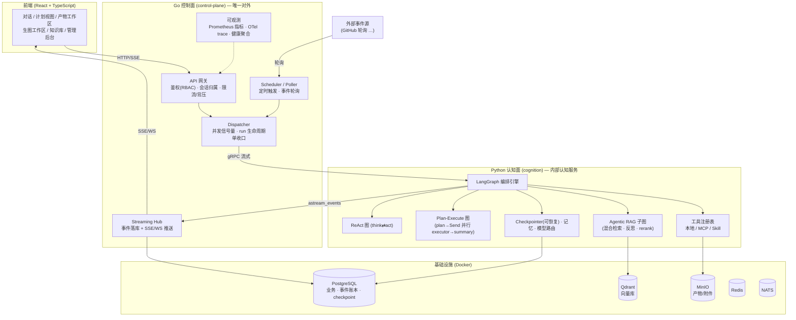
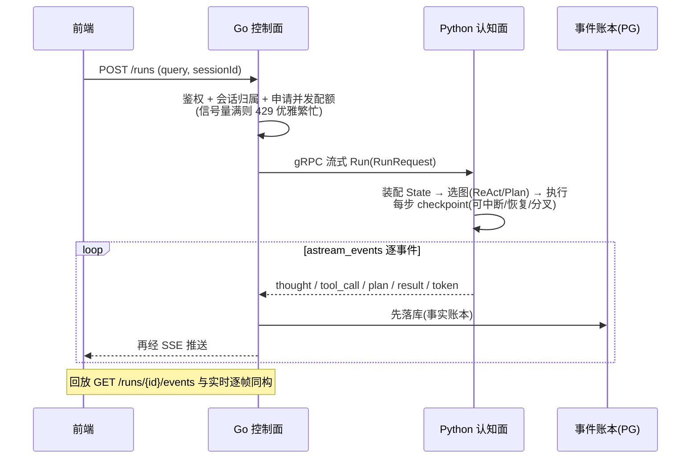
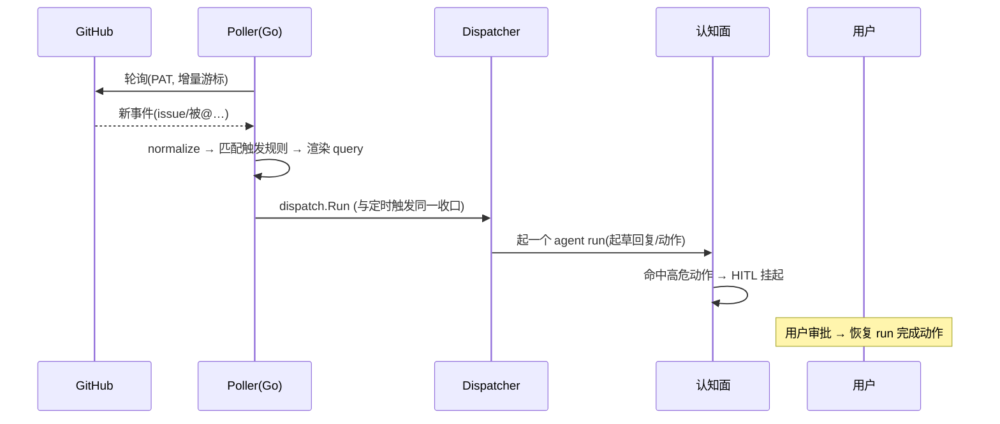
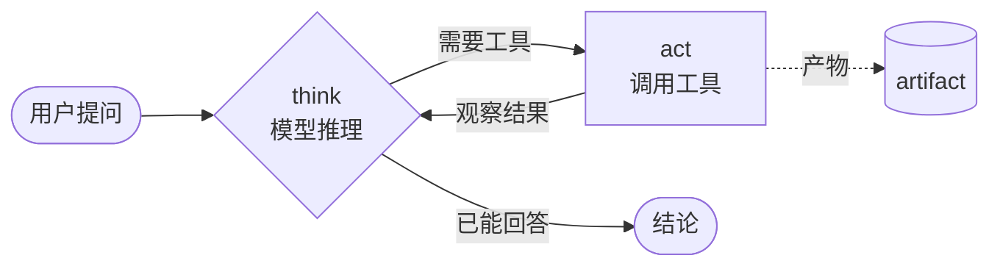
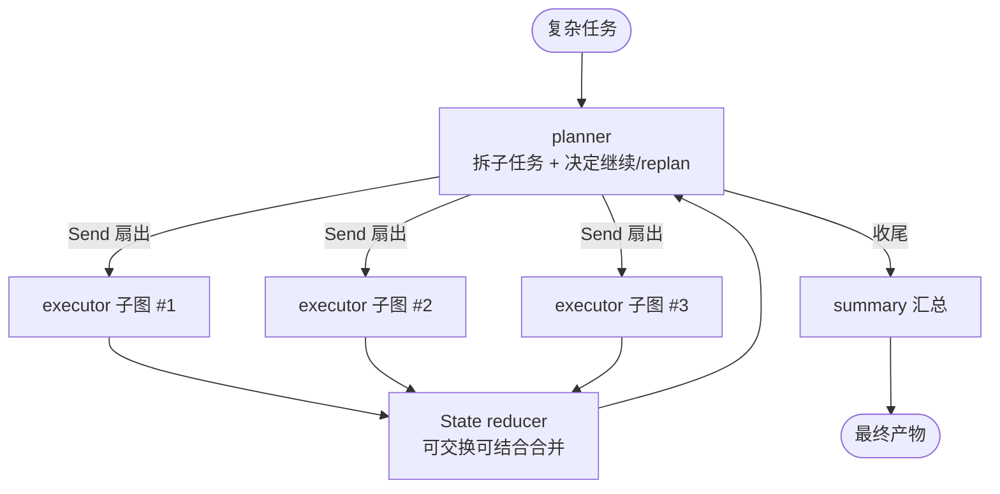
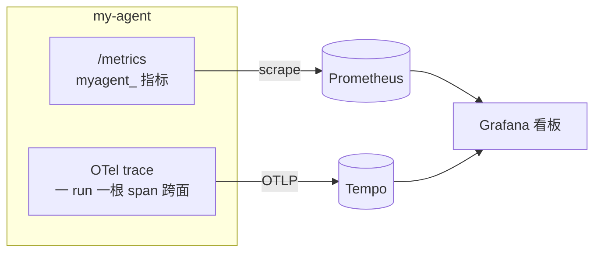

<div align="center">

# pro-agent

**一个生产形态的多智能体应用平台 · Go 控制面 + Python(LangGraph) 认知面**

把"被动问答的聊天机器人"升级为"可编排、可观测、可回放、可主动触发的复杂任务执行系统"。

</div>

> 截图占位（待补充）：`docs/assets/hero.png` —— 首页对话流式 + 计划视图 + 产物工作区整体观感。
> <!--  -->

---

## 目录

- [它解决什么问题](#它解决什么问题)
- [核心亮点](#核心亮点)
- [双平面架构](#双平面架构)
- [两条核心数据流](#两条核心数据流)
- [单 Agent 内部与多 Agent 协作](#单-agent-内部与多-agent-协作)
- [能力全景](#能力全景)
- [可观测性](#可观测性)
- [技术栈](#技术栈)
- [快速开始](#快速开始)
- [目录结构](#目录结构)
- [路线图](#路线图)

---

## 它解决什么问题

普通的"大模型套壳"应用停留在一问一答：模型答完即忘、多步任务靠用户手动拆解、工具能力硬编码、出了问题无从复盘、只能等用户主动来问。本平台针对这些痛点做了系统性设计：

| 痛点 | 本平台的解法 |
|---|---|
| 复杂任务要用户自己拆步骤 | **ReAct + Plan-Execute 双编排**：模型自己规划、并行执行子任务、按结果动态 replan |
| 模型答完就忘、换个会话失忆 | **LangGraph checkpoint 记忆** + 服务端会话账本，多轮续聊、跨设备一致、可从任意历史轮**分叉出平行时间线** |
| 加一个新能力就要改代码重部署 | **统一工具生态**：本地工具 / MCP 三传输 / Skill 渐进式披露，加能力=加配置/加文件 |
| 知识问答召回差、只能纯文本 | **Agentic RAG**：dense+sparse 混合检索 + 多轮反思 + rerank；附件自动入库（含图片/扫描 PDF 的 vision OCR、表格/多栏还原） |
| 高并发下容易雪崩 | **Go 控制面承载并发与背压**：goroutine + 信号量 + context 取消 + 网关限流，"优雅繁忙"替代雪崩 |
| 出问题无法复盘、体验无法恢复 | **执行事实账本 + 回放同构**：每一步落库，历史回放与实时流逐帧一致 |
| 只能被动等用户提问 | **Proactive 连接器**：外部事件（GitHub 等）自动触发 agent，高危动作走人工审批闸 |
| 生产环境看不见、管不了 | **Prometheus 指标 + OTel 链路追踪 + Grafana 看板 + 多用户 RBAC + 管理后台** |

---

## 核心亮点

- **双编排混合**：快速 ReAct（think⇄act 环）/ 深度思考 Plan-Execute（规划→并行子执行器→汇总→replan）/ 深度研究（多轮检索-验证-引用）三档一键切换。
- **可控的并行子智能体**：基于 LangGraph `Send` 扇出，自研并行宽度、预算、超时、状态合并（可交换可结合的 reducer）、失败隔离——把长链路任务的耗时压下来且保证产物与账本归属一致。
- **执行即资产**：统一事件 schema + 事件账本，实时与回放同构（不靠重跑、靠事件重放）；支撑问题定位与体验恢复。
- **人在环上（HITL）**："审批 = run 边界"，高危工具执行前挂起、跨刷新/重启/隔夜可批，决议入账本、回放可见完整决策链。
- **生图工作区**：文生图 / 图生图 / **inpaint 局部重绘**（画布蒙版 + 逐像素保留背景）/ 生成图内联进网页，一站式创作闭环。
- **工程化就绪**：模型分层路由（强模型规划、性价比模型执行）+ Docker 一键起全套依赖 + 全链路可观测 + 多租户鉴权，为规模化预留可插拔边界。

> 截图占位（待补充）：`docs/assets/orchestration.png`（计划视图 + 并行子任务卡片）、`docs/assets/hitl.png`（人工审批卡）。

---

## 双平面架构

**两个平面各司其职**：Go 握住"面向世界的一切"，Python 握住"思考的一切"，两面用 gRPC 流式通信，Go 是唯一对外入口。



**Go 控制面**：API / 流式（SSE/WS）、并发与调度（goroutine + 信号量 + context 取消）、背压/降载、执行事实记录与历史回放分发、连接器/事件驱动、健康与可观测、密钥与多租户。

**Python 认知面**：用 LangGraph 把 ReAct / Plan-Execute / Agentic RAG 表达成**图**，承载工具（本地 / MCP / Skill）、技能与 SOP、记忆、模型路由。

---

## 两条核心数据流

### 流 A：用户主动请求（同步、流式）



### 流 B：外部事件主动触发（Proactive）



---

## 单 Agent 内部与多 Agent 协作

### 单 Agent：ReAct 环

一个 Agent 内部是"思考→行动→观察"的有环图：模型思考后决定调用哪个工具，工具结果作为观察回灌，循环直到给出结论。类型化的 State（相当于 AgentContext）承载消息、工具、产物；每步落 checkpoint，天然可中断、可恢复。



### 多 Agent：Plan-Execute + Send 扇出

复杂任务由规划器拆成多个子任务，经 LangGraph `Send` **并行扇出**给多个 executor 子图，各自独立执行（隔离、超时、失败降级），结果经 **reducer 合并**回主状态，规划器据此决定继续、replan 或收尾。这是"框架做扇出、我控制宽度/预算/合并/归属"的典型。



**三级并发**：请求级（Go goroutine + 信号量）、任务级（LangGraph `Send` 并行子任务）、工具级（子图内工具调用）——每一级都有背压与归属控制。

---

## 能力全景

> 完整触发方式与示例见 `docs/09-能力地图与使用手册.md`。

### 编排与执行
- **三档推理模式**：快速（ReAct）/ 深度思考（Plan-Execute + 并行子任务）/ 深度研究（多轮检索-验证-引用）。
- **动态 replan**：规划器根据子任务结果决定继续、重规划或收尾。
- **可恢复执行**：每步 checkpoint，长任务可中断续跑。

### 工具与产物
- **统一工具生态**：本地工具 / MCP（stdio·sse·streamable_http 三传输，预热+缓存+串行）/ Skill（SKILL.md 渐进式披露 + 沙箱脚本运行器）。
- **产物登记与复用**：工具产物落对象存储、按 run/tool_call 归属、跨工具复用；跨会话产物画廊（游标分页）。
- **生产技能**：数据分析（DuckDB）/ 图表 / PPT / 网页设计 / 图像风格库 / GitHub 深度调研。

### 知识与记忆
- **Agentic RAG**：Qdrant dense+sparse 混合检索（RRF 融合）+ 多轮反思 + rerank + 带引用生成。
- **用户知识库闭环**：附件上传 → 自动入库 → 引用回答 → 面板管理（删除只影响此后检索）。
- **更强文档解析**：文本/docx/xlsx/PDF；**图片与扫描 PDF 逐页 vision OCR**；**PDF 表格 → markdown、多栏阅读顺序还原、公式整页兜底**。
- **会话记忆与续聊**：LangGraph thread checkpoint 多轮记忆 + 服务端会话账本 + 跨设备一致。
- **会话分叉 / 时间旅行**：从任意历史轮分叉出平行会话，继承分叉点之前的记忆、独立演化。

### 多模态与生成
- **多模态输入**：图片（vision 门控）、表格文件引用。
- **生图工作区**：文生图 / 图生图 / **inpaint 局部重绘（画布蒙版 + `/images/edits` mask）** / 生成图内联进网页。

### 主动与协作
- **HITL 人工审批**：审批=run 边界，挂起-恢复跨双平面一致，决议入账本。
- **定时触发**：cron 式 schedules，到点自动跑 headless run。
- **Proactive 连接器**：GitHub PAT 轮询 → 触发规则 → 自动起 agent → 高危动作走审批。

### 工程化
- **多用户 + RBAC**：密码登录 + 两角色 + 管理后台（用户 / 全部运行 / 系统统计）。
- **可观测**：Prometheus 指标（并发/背压/时长/tokens/调度）+ OTel 跨面链路追踪 + Grafana 看板 + 成本面板。
- **健康与背压**：`/healthz` 聚合探活；并发上限下"优雅繁忙"（429）替代雪崩。
- **一键部署**：`make stack-up` 单端口起完整平台；E2E Playwright 浏览器测试。

> 截图占位（待补充）：`docs/assets/generate-workspace.png`（生图工作区 + 蒙版编辑器）、`docs/assets/gallery.png`（产物画廊）、`docs/assets/kb.png`（知识库管理）、`docs/assets/admin.png`（管理后台）、`docs/assets/grafana.png`（Grafana 看板）、`docs/assets/fork.png`（会话分叉分界线）。

---

## 可观测性



- **指标**（Prometheus，默认开）：run 并发水位 / 终态计数 / 时长分位 / 429 拒绝 / tokens / SSE 帧 / 调度 / 连接池——量化"优雅繁忙"与吞吐。
- **链路追踪**（OTel，config-gated 默认关）：一次 run = 一根 trace，跨 Go↔Python 一条链，trace_id 关联两面结构化日志。
- **看板**：`deploy/observability/` 提供 Grafana datasource + dashboard JSON（provisioning 可复现）。

---

## 技术栈

后端控制面 **Go**（chi · pgx · gRPC）· 认知面 **Python + LangGraph** · LLM **Claude / DeepSeek**（分层路由）· 生图 **gpt-image**（provider 抽象可切换）· 向量库 **Qdrant** · 主库 **PostgreSQL**（业务 + 事件账本 + checkpoint）· 对象存储 **MinIO** · 缓存 **Redis** · 事件 **NATS** · 可观测 **Prometheus + OpenTelemetry + Grafana** · 前端 **React 19 + TypeScript + Vite + Tailwind + shadcn/ui** · 部署 **Docker Compose**。

---

## 快速开始

```bash
cd my-agent

# 1. 起依赖（PostgreSQL / Qdrant / Redis / MinIO / NATS）
make infra-up

# 2. 配置：cp -n deploy/.env.example deploy/.env，填 LLM/生图 API Key

# 3a. 开发模式（三个终端）
make cognition    # 认知面 gRPC :50051
make control      # 控制面 HTTP/SSE :8080
make web          # 前端 Vite :5173

# 3b. 或一键完整平台（Go 单端口托管前端）
make stack-up     # → http://localhost:8080

# 无 Key 冒烟：COGNITION_FAKE_MODEL=1 make stack-up
# 全部测试：make check     浏览器 E2E：make e2e
```

---

## 目录结构

```
my-agent/
├── control-plane/     # Go 控制面（API/调度/并发/流式/账本/连接器/可观测/鉴权）
├── cognition/         # Python 认知面（LangGraph 图/工具/技能/RAG/记忆/路由）
├── web/               # 前端（React + TS + shadcn/ui）
├── deploy/            # docker-compose + 可观测 provisioning
└── proto/             # Go↔Python gRPC 契约（事件流 schema）
```

---

## 路线图

已交付：双编排 · 工具生态（本地/MCP/Skill）· Agentic RAG · 记忆与回放 · 会话续聊与分叉 · 多模态与知识库 · 三档模式与生产技能 · 生图工作区（含 inpaint）· HITL 审批 · 定时/事件触发 · 成本面板 · Prometheus + OTel + Grafana 可观测 · 多用户 RBAC 与管理后台 · Playwright E2E。

规划中：数据问答 NL2SQL / TableRAG · Gmail/飞书连接器（OAuth）· 完整 Eval 体系 · 真沙箱（gVisor/microVM）· MinerU 级版式解析。

---

<div align="center">
<sub>用工程的方式做 Agent：不只是"能跑"，而是可编排、可观测、可回放、可协作、可规模化。</sub>
</div>
